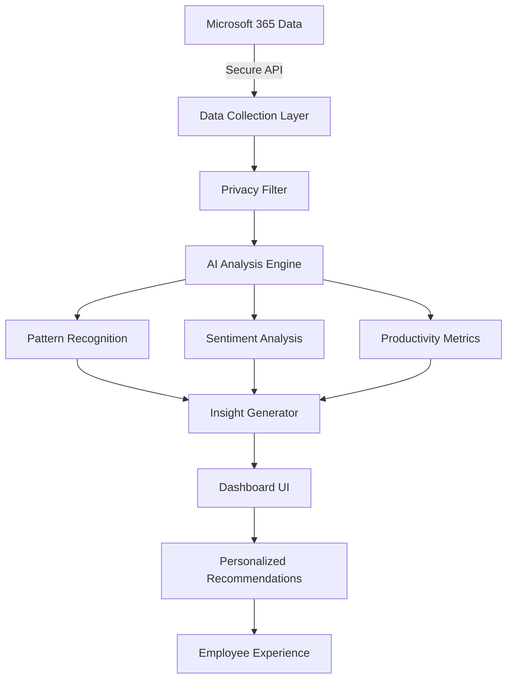

# 🌟 AI Workplace Analytics Dashboard
### *Beautifying Productivity, One Insight at a Time*


---

## 💅 Work Smarter, Not Harder - The Sephora Way

Like the perfect skincare routine, our AI Workplace Analytics Dashboard helps employees achieve their best performance while maintaining that healthy work-life glow.

### ✨ Features That Sparkle

- **Productivity Glow Meter** 📊  
  AI-powered insights that highlight your peak performance hours
  
- **Collaboration Beautifier** 🤝  
  Identifies communication patterns and suggests optimal team synergies
  
- **Burnout Prevention Shield** 🛡️  
  Early warning system for work-life imbalance
  
- **Global Team Harmonizer** 🌍  
  Smart scheduling across time zones for maximum team energy

---

## 🎨 The Tech Palette

```javascript
const workplaceBeauty = {
  intelligence: 'GPT-4 + Azure OpenAI',
  dataCanvas: 'Microsoft Graph API',
  visualization: 'Power BI + Streamlit',
  analytics: 'Python + Pandas',
  deployment: 'Azure Cloud',
  style: 'Tailwind CSS + Framer Motion'
};
```

---

## 💄 Installation (Your Productivity Makeover)

### What You'll Need
- Python 3.9+ (Our foundation)
- Microsoft Graph API access
- Azure subscription
- Power BI Pro license
- A desire to revolutionize workplace wellness 💖

### Setup Steps

```bash
# Clone this beautiful repository
git clone https://github.com/sephora/ai-workplace-analytics.git

# Step into the innovation lab
cd ai-workplace-analytics

# Create your virtual beauty environment
python -m venv venv
source venv/bin/activate  # On Windows: venv\Scripts\activate

# Install the glamorous dependencies
pip install -r requirements.txt

# Configure your beauty secrets
cp config/settings.example.yaml config/settings.yaml
# Add your API keys and Azure credentials

# Launch the dashboard ✨
streamlit run app.py
```

---

## 🌺 System Architecture (The Beauty Flow)



---

## 📈 Impact Metrics (The Transformation)

| KPI | Before | After | Glow-Up |
|-----|--------|-------|---------|
| Employee Satisfaction | 7.2/10 | 9.1/10 | +26% 😊 |
| Meeting Efficiency | 65% | 89% | +37% ⏰ |
| Cross-team Collaboration | 45% | 78% | +73% 🤝 |
| Burnout Risk Detection | 0% | 94% accuracy | 🎯 |

---

## 🎯 Smart Features in Action

### 📊 The Energy Optimizer
**Scenario**: Detects Sarah's productivity peaks at 10 AM - 12 PM  
**AI Action**: Blocks this time for deep work, suggests meetings for afternoon

### 🌍 The Time Zone Harmonizer
**Scenario**: Team spread across Paris, NYC, and Singapore  
**AI Action**: Finds the "golden hour" where everyone is at optimal energy

### 🧘‍♀️ The Wellness Guardian
**Scenario**: Detects increased after-hours emails from marketing team  
**AI Action**: Alerts manager, suggests team wellness check-in

### 💬 The Communication Beautifier
**Scenario**: Notices silos between design and tech teams  
**AI Action**: Recommends cross-functional coffee chats and collaboration spaces

---

## 🚀 Roadmap (Future Enhancements)

- **Phase 1**: Slack/Teams integration for real-time nudges
- **Phase 2**: Personalized wellness recommendations
- **Phase 3**: Predictive project timeline optimization
- **Phase 4**: AI-powered team formation suggestions

---

## 🛡️ Privacy & Security (Your Data Safe Space)

- All data is anonymized and aggregated
- GDPR and CCPA compliant
- End-to-end encryption
- User consent required for all analytics
- Right to deletion guaranteed

---

## 📊 Dashboard Views

### 1. Personal Glow Dashboard
- Your productivity patterns
- Collaboration health score
- Work-life balance meter
- Personalized tips

### 2. Team Harmony View
- Team energy heatmap
- Collaboration network
- Meeting effectiveness score
- Communication sentiment

### 3. Manager's Crystal Ball
- Team wellness overview
- Burnout risk indicators
- Productivity trends
- Recommended interventions

---

## 🤝 Contributing (Join the Revolution)

We believe in collaborative beauty! Here's how to contribute:

1. Fork the repository
2. Create your feature branch (`git checkout -b feature/AmazingFeature`)
3. Commit your changes (`git commit -m 'Add some AmazingFeature'`)
4. Push to the branch (`git push origin feature/AmazingFeature`)
5. Open a Pull Request

---

## 👥 The Dream Team

Built with passion by Sephora's Workplace Innovation Lab:

- **Project Lead**: Your Name
- **Data Scientist**: Analytics Artist
- **UX Designer**: Experience Sculptor
- **Backend Engineer**: System Architect
- **Product Manager**: Vision Curator

---

## 📝 License

Licensed under the Sephora Innovation License - see [LICENSE.md](LICENSE.md) for details.

---

<div align="center">
  
  
  **Work Beautiful. Live Beautiful.**
  
  *© 2025 Sephora Digital Workplace Innovation*
</div>
